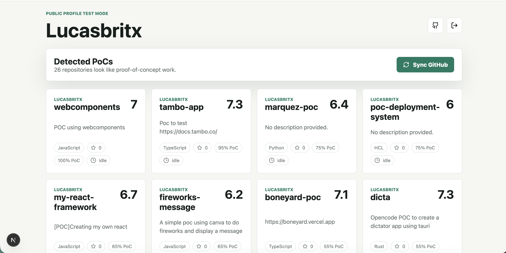
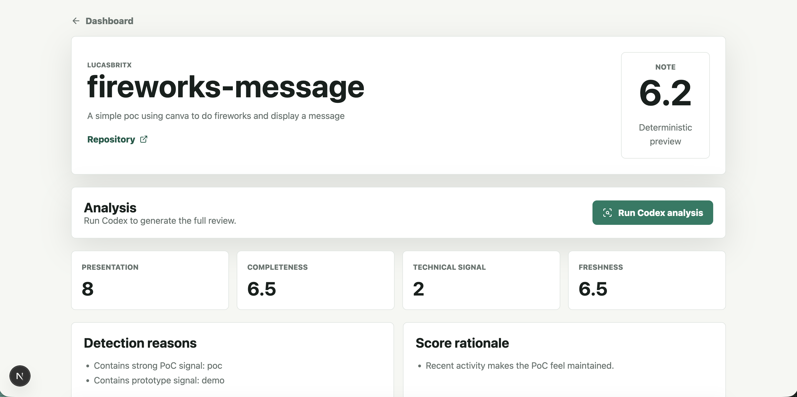
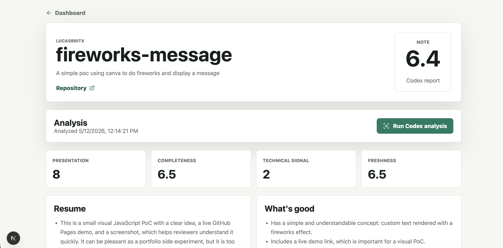
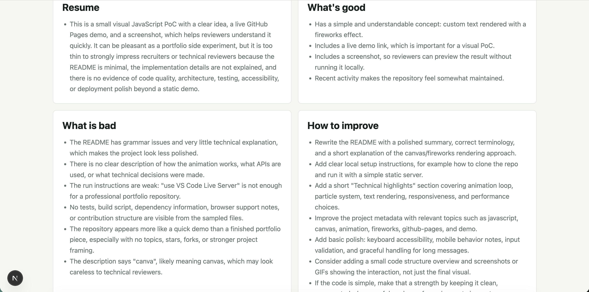

# GitHub PoC Analyzer

A local-first Next.js app that reviews public GitHub proof-of-concept repositories from a portfolio perspective.

The app can verify a user through GitHub OAuth, or search a public username for testing. It detects PoC-like repositories, scores them from 0-10, and uses the local Codex SDK/CLI to generate a concise review with strengths, weaknesses, and improvements.

## Features

- GitHub OAuth login for verified personal analysis.
- Username search test mode for public profile/repo checks.
- Automatic PoC detection from repository names, descriptions, topics, and README content.
- Hybrid scoring: deterministic repository signals plus Codex-generated written feedback.
- Local SQLite persistence through Node's built-in `node:sqlite`.
- Dashboard and per-repository report views.

## Setup

Install dependencies:

```bash
npm install
```

Create `.env.local`:

```env
GITHUB_CLIENT_ID=
GITHUB_CLIENT_SECRET=
GITHUB_TOKEN=
NEXT_PUBLIC_APP_URL=http://localhost:3000
```

For OAuth, create a GitHub OAuth app with this callback URL:

```text
http://localhost:3000/api/auth/callback
```

`GITHUB_TOKEN` is optional, but recommended for username test mode so public GitHub API requests get authenticated rate limits.

## Development

Run the app:

```bash
npm run dev
```

Open:

```text
http://localhost:3000
```

Run checks:

```bash
npm test
npx tsc --noEmit
npm run build
```

## How It Works

1. The user signs in with GitHub OAuth or enters a public username.
2. The app syncs public repositories and samples bounded repository context.
3. PoC detection flags likely prototypes, demos, MVPs, experiments, or proof-of-concept projects.
4. Deterministic scoring evaluates presentation, completeness, technical signal, and freshness.
5. Codex SDK runs locally through the `codex` CLI to produce the final report.

## Screenshots





## Notes

- Private repositories are out of scope for v1.
- `.env.local`, `data/`, and generated build/cache files are intentionally ignored.
- `node:sqlite` is currently experimental in Node, so builds may print an experimental warning.
